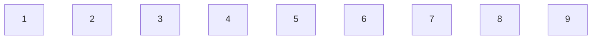
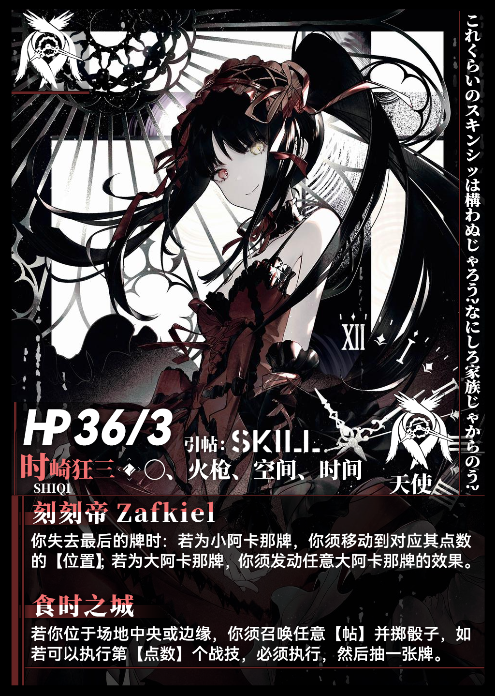
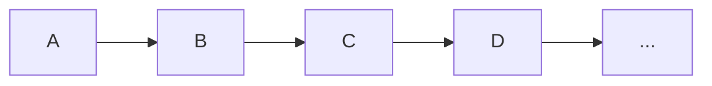
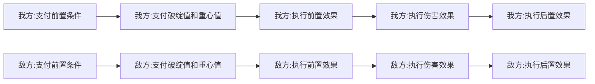
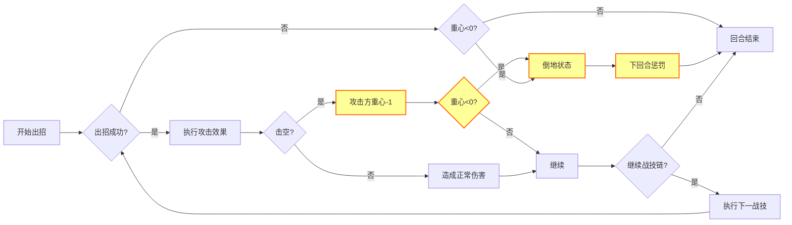
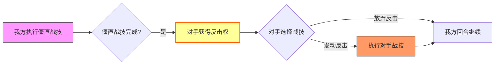
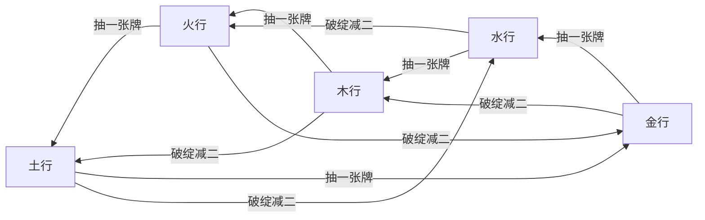

# 法典

[TOC]

# 游戏组件

场地牌：9张

角色牌：23张

角色指示牌：4张

角色标记牌：4张

角色血量牌：4张

游戏牌：44张

战技指示牌：112张（可选）

计算骰子：12个

总计：200张牌+12个骰子

# 简介

### **《法典》—— 一维战线的战术卡牌对决**

*在九格直线战场上运筹帷幄，用卡牌与位移谱写致命连招！*

#### **游戏简介**

《法典》是一款在线性战场上展开的卡牌战术对战游戏。两名玩家在**1×9的直线战场**（位置1至9依次排列）中博弈：通过组合流派战技形成**战技链**，精准控制**破绽值**与**重心值**，辅以**塔罗牌系统**调度资源。胜负取决于卡牌组合、位移控制与风险计算的三角平衡！

------

### **核心机制革新**

#### 🎯 **线性战场，距离即生死**

-   **九格单线战场**：位置1（我方起点）至9（敌方起点）直线排布，**距离=位置差值**（如从位3到位6需3步）
-   **位移连锁效应**：
     ✅ ​**​击退/拉近​**​：强制改变敌我位置差（如枪帖「直贯」击退2步）
     ⚠️ ​**​撞墙惩罚​**​：将对手逼至位置1或9时可能触发追加伤害！
-   **位置战略价值**：
     ▶️ 空间帖依赖​**​数字位置​**​（如「五之律」需站位置5）
     ▶️ 刺客帖需绕至​**​对手身后​**​

#### ⚡ **战技链系统——破绽的艺术**

-   **12点破绽上限**：每回合战技链总破绽值≤12，超限崩溃！
-   **致命取舍**：
     ⚡️ ​**​僵直战技​**​（==高亮标注==）威力巨大，但发动后​**​对手获得反击权​**​！

#### 🃏 **卡牌驱动战术**

| 卡牌类型               | 功能说明                             | 战术意义 |
| ---------------------- | ------------------------------------ | -------- |
| **大阿卡那牌**（12张） | 扭转战局（如「教皇」使下招破绽值=2） | 战略资源 |
| **小阿卡那牌**（32张） | 战技燃料（宝剑=剑术/权杖=位移）      | 流派核心 |

>   ✨ **卡牌联动**：弃牌触发被动（如火枪帖「游击」弃权杖可移动），资源管理=胜负关键！

#### 🎭 **角色构筑深度**

角色由三大模块定义：

-   **引帖**：选择战斗流派（拳/剑/法/枪/时空等）
-   **赐福**：主动技能（如法师「火舌」弃牌灼烧，以及角色的技能）
-   **诅咒**：被动代价（如「嗜血」增伤但自损体力）

>   **流派战术范例**：
>
>   -   **火枪帖**：用「装填」叠加伤害，「炮决」在位置1狙杀位置9的敌人
>   -   **空间帖**：通过「拓扑跳跃」瞬移质数位（2/3/5/7）触发数字律
>   -   **刺客帖**：用「幽步」镜像位移绕后发动「背身突刺」

------

### **胜负判定**

🏁 **终结对手的两种方式**：

1.  **常规击杀**：将对手体力值削减至0
2.  **战术处决**：满足条件秒杀（如枪帖「炮决」最远距离击杀）

------

### **线性战场特色策略**

-   **距离控制**：近战需拉近距离（拳术攻击距离0-1），远程需保持射程（火枪攻击3-8）
-   **位移组合技**：
     → 剑术「直刺」击退3步 → 接「穿心刺」撞墙追加伤害
     → 法帖「牵引」拉敌两步 → 刺客触发「背刺」位条件
-   **端点封锁**：将对手压至位置1或9限制移动，配合撞墙技爆发

------

**进入《法典》世界，在直线战场上用卡牌编织死亡乐章！**

>   *“这不是简单的抽卡游戏——每一次位移都在重塑生死线，每一张牌都在撕裂时空！”*

#游戏规则

### 核心机制

本游戏是卡牌驱动的战术对决系统，双方在九格场地上轮流行动。核心战斗采用"战技链"系统：玩家通过组合不同战技形成连招，但需控制破绽值总和（≤12），并用重心值弥补骰运不足。

### 角色牌

角色立绘 例：

#### 引帖

引帖包含角色的主要战技。**设计案例**：

>   各种“帖”类技能体系

一般来说，一个角色会携带两个以上的“帖”。

#### 赐福

赐福是角色的特殊技能或战技。**设计案例**：

>   刺客系：「背刺」：需满足背后位，距离1且敌我朝向相反
>
>   法师系：「飞弹」：距离每增加两步，伤害加一
>
>   ……

一般来说，一个角色会携带一个以上的“赐福”。

#### 诅咒

诅咒是角色的被动技能，满足条件必须发动。典型设计：

>   「嗜血」：造成伤害加一，然后自身流失一点体力或弃一张牌
>   「笨重」：若上一招行动过，此招破绽值加一
>   「失控」：使用法术后，弃一张牌

一般来说，一个角色会携带一个或更多“诅咒”，“诅咒”不一定是坏的，但一定有负面效果。

#### 体力值、重心值

体力值：40左右；重心值：3左右；也可能会有其他数值在此处标记。

### 战斗场地

战斗场地有九个空位。双方最开始处于“1”和“9”。

### 回合流程

每个回合开始时，无论是谁的回合，都会将破绽值重置为12。

当自己的回合开始时：

####复原重心值

把重心值恢复为原始值。

#### 组织战技

战技可以无限组织，但一回合内自身的战技【破绽值】总和不得超过12，同时，不满足战技的触发条件时，回合也结束。

执行每一招战技，若中间的效果执行失败，则后面的效果不会执行：

出招流程：

僵直战技执行后，可能会插入对手的反击：

正常战技执行时，可能会插入对手的迅捷战技：

```mermaid
graph LR
	A1[我方支付前置条件]-->B1[敌方支付前置条件]-->A2[破绽/重心]-->B2[破绽/重心]-->A3[前]-->B3[前]-->A4[伤]-->B4[伤]-->A5[后]-->B5[后];
	style A1 fill:#f9f,stroke:#333
	style A2 fill:#f9f,stroke:#333
	style A3 fill:#f9f,stroke:#333
	style A4 fill:#f9f,stroke:#333
	style A5 fill:#f9f,stroke:#333
	style B1 fill:#f96,stroke:#333
    style B2 fill:#f96,stroke:#333
    style B3 fill:#f96,stroke:#333
    style B4 fill:#f96,stroke:#333
    style B5 fill:#f96,stroke:#333
```

==倒地状态==：下回合不可出招且受到伤害加一。

==高亮的战技==为**僵直战技**，发动==高亮的战技==结束后，对手可以出招反击一次（只有在自己的回合外，才有反击一说）。

*带星号战技为迅捷战技，可以在对手出招时同时发动。

### 游戏牌

####大阿卡那牌-12张

用有效果的牌，一共12张（相比传统塔罗牌减少了许多）：

0.   愚人（Fool）效果：展示手牌，然后观看对手的手牌。
1.   魔术师（Magician）效果：弃若干牌，抽等量牌。
2.   女祭司（High Priestess）效果：可当作任何小阿卡那牌。
3.   皇后（Empress）效果：抽两张牌。
4.   皇帝（Emperor）效果：抽三张牌。
5.   教皇（Hierophant）效果：下一个战技的破绽值改为〇。
6.   恋人（Lovers）效果：所有人抽一张牌，加四点体力值。
7.   战车（Chariot）效果：下个战技的伤害加三。
8.   隐士（Hermit）效果：重心值加三。
9.   倒吊人（Hanged Man）效果：取消一张牌的效果。
10.   死神（Death）效果：所有人受到四点伤害。
11.   恶魔（Devil）效果：获得对手一张牌。

####小阿卡那牌-32张

用于发动战技的消耗，没有特殊的效果：

-   **权杖（Wands）1~8**
-   **宝剑（Swords）1~8**
-   **圣杯（Cups）1~8**
-   **星币（Pentacles）1~8**

### 胜负判定

胜利条件：

1.  ==对手体力归零==
2.  ==特殊击杀==（如《火枪帖》·「炮决」最远距离击杀）

# 战技帖

### **一、基础战斗术语**

|   **术语**   |                  **定义**                   |          **应用场景**           |
| :----------: | :-----------------------------------------: | :-----------------------------: |
|  **破绽值**  | 战技的“风险值”，战技链总和≤12（破绽值上限） | 所有战技右上角标注（如破绽值3） |
|  **重心值**  |      防失误资源（初始约3点），<0时倒地      |  支付失败时消耗，倒地状态惩罚   |
| **僵直战技** |  高亮标注（==技能名==），发动后让出反击权   |   高伤害技如拳帖「蓄力冲拳」    |
| **迅捷战技** |       *标记，可插入对手任何战技中行动       |       刺客帖「背身突刺」        |
| **攻击距离** |      生效的格子范围（如1~3、*全距离）       | 火枪帖需4+距离，拳术需0、1距离  |
|   **撞墙**   | 被**击退**至端点（位置1或9）触发的追加效果  |      枪帖「崩山」追加伤害       |

------

### **二、位移与位置术语**

|   **术语**    |                **定义**                 |         **流派应用**         |
| :-----------: | :-------------------------------------: | :--------------------------: |
| **击退/拉近** |     强制改变对手位置（步数=位移值）     |     剑帖「直刺」击退3步      |
| **背朝对手**  |          双方朝向相反的特殊位           |    刺客帖「背刺」核心条件    |
| **质数位置**  |     位置2/3/5/7（九格战场特殊点位）     |   游侠帖「直觉」被动增益位   |
| **镜像位移**  | 以位置5为中轴的对称移动（原位置X→10-X） |      空间帖「空间切割」      |
|  **标记位**   |    可放置的战术坐标（不同流派互通）     | 玩偶帖傀儡/刺客残影/时间残影 |

------

**注：在角色发动战技时，该角色自动改为面朝对手。**

### **三、资源管理术语**

|   **术语**   |         **定义**         |        **卡牌联动**         |
| :----------: | :----------------------: | :-------------------------: |
|   **弃牌**   |   丢弃手牌支付战技代价   |   火枪帖「装填」弃牌增伤    |
|   **抽牌**   |      从牌库补充手牌      |        「启示」抽3张        |
|  **同类牌**  | 同花色小阿卡那或大阿卡那 | 空间帖「拓扑跳跃」需弃3同类 |
| **大阿卡那** |  12张特效牌（编号0-11）  |    「教皇」使下招破绽=0     |

------

### **四、状态与效果术语**

|   **术语**   |              **定义**              |      **触发机制**      |
| :----------: | :--------------------------------: | :--------------------: |
|   **禁锢**   |      下回合无法移动，但可攻击      |   空间帖「空间禁锢」   |
| **穿透伤害** |        对路径上所有目标生效        |    游侠帖「穿林箭」    |
| **追加伤害** | 满足条件（如撞墙）时附加的额外伤害 | 拳帖「铁山靠」撞墙+5伤 |
| **伤害减免** |          减少受到的伤害值          |   法帖「寒霜」减1伤    |
| **体力交换** |           双方体力值互换           |   刺客帖「绝影归寂」   |

## 〇

〇为全角色必备的基础战技帖。

### 1·洞察

-   **攻击距离**：1、2；**伤害**：0；**破绽值**：2
-   **前置条件**：弃一张圣杯牌和一张权杖牌
-   **后续效果**：观看对手手牌，抽一张牌

### 2·抉择

-   **攻击距离**：3~8；**伤害**：0；**破绽值**：3
-   **前置条件**：弃一张权杖牌和星币牌
-   **后续效果**：抽两张牌，或重心值加二

###3·敏锐

-   **攻击距离**：1、2；**伤害**：0；**重心值**：1
-   **前置条件**：弃一张宝剑牌
-   **后续效果**：下一招破绽减三

###4·启示

-   **攻击距离**：\*；**伤害**：0；**破绽值**：3
-   **前置条件**：弃一张星币牌和一张圣杯牌
-   **后续效果**：抽三张牌

### 5·灵感

-   **攻击距离**：3~8；**伤害**：0；**破绽值**：4
-   **后续效果**：抽一张牌

###6·出拳

-   **攻击距离**：0、1；**伤害**：1；**破绽值**：3

### 7·头槌

-   **攻击距离**：0；**伤害**：3；**破绽值**：4
-   **后续效果**：击退一步

### 8·移动

-   **攻击距离**：\*；**伤害**：0；**破绽值**：$\ 2x$
-   **前置条件**：本回合位置没有改变
-   **后续效果**：行动$\ x $步

## 一·拳帖

### 「激怒」

自己回合内受到伤害时，下一招【破绽值】减一。

### 「嘲讽」

对手可以反击时，若不反击，受到四点伤害。

### 1.1·==拳术·直冲==

-   **攻击距离**：2；**伤害**：3；**破绽值**：1
-   **前置效果**：可向前一步
-   **后续效果**：可击退一步

### 1.2·*拳术·钩拳

-   **攻击距离**：1；**伤害**：2；**破绽值**：2
-   **前置条件**：弃一张宝剑牌
-   **后续效果**：击退一步，抽一张牌

### 1.3·*拳术·闪步

-   **攻击距离**：1；**伤害**：0；**破绽值**：3；**重心值**：1
-   **前置条件**：弃一张星币牌和宝剑牌
-   **前置效果**：取消本次伤害与击退效果
-   **后续效果**：抽一张牌或行动一步

### 2·==下段踢==

-   **攻击距离**：2；**伤害**：2；**破绽值**：3；**重心值**：1
-   **前置条件**：弃一张宝剑牌
-   **后续效果**：抽一张牌，作为反击招式时，对手【重心值】减二

### 3·擒拿

-   **攻击距离**：2、3；**伤害**：1；**破绽值**：2
-   **后续效果**：拉近对手一步

### 4·==蓄力冲拳==

-   **攻击距离**：1；**伤害**：$【本回合累计出招数】$；**破绽值**：3
-   **后续效果**：击退$【本回合累计出招数】$步，抽一张牌

### 5·==无影拳==

-   **攻击距离**：2；**伤害**：$\ 2×7$；**破绽值**：7；**重心值**：2
-   **前置条件**：弃三张星币牌
-   **前置效果**：向前一步
-   **后续效果**：视为七次独立的战技，抽三张牌

### 6·*虎扑

-   **攻击距离**：3、4；**伤害**：2；**破绽值**：3；**重心值**：1
-   **前置条件**：上一招结束时，背对对手
-   **后续效果**：向前行动到对手的位置，抽一张牌

### 7·==铁山靠==

-   **攻击距离**：1；**伤害**：3；**破绽值**：4
-   **前置条件**：弃两张大阿卡那牌
-   **后续效果**：击退两步，若对手撞墙：追加五点伤害，抽三张牌

### 8·*截脉指

-   **攻击距离**：1、2；**伤害**：0；**破绽值**：2；**重心值**：1
-   **前置条件**：本回合击退过对手
-   **前置效果**：行动一步
-   **后续效果**：弃对手一张牌，可自减一点体力以获得此牌

## 二·剑帖

### 「猩红」

击退时，可自减一点体力，抽一张牌。

### 1.1·==剑术·直刺==

-   **攻击距离**：3；**伤害**：4；**破绽值**：2
-   **前置效果**：向前一步
-   **后续效果**：击退三步

### 1.2·剑术·横斩

-   **攻击距离**：2；**伤害**：2；**破绽值**：2
-   **前置条件**：弃一张宝剑牌或令本回合所有剑术破绽值加一
-   **前置效果**：向前一步
-   **后续效果**：击退一步

### 1.3·剑术·上挑

-   **攻击距离**：1、2；**伤害**：1；**破绽值**：3；**重心值**：1
-   **后续效果**：可后退三步

### 1.4·==剑术·下劈==

-   **攻击距离**：2；**伤害**：3；**破绽值**：3
-   **前置条件**：对手反击过
-   **后续效果**：向前一步，抽一张牌

### 2·*格挡

-   **攻击距离**：1~8；**伤害**：0；**破绽值**：4；**重心值**：1
-   **前置条件**：弃一张宝剑牌
-   **前置效果**：取消被击退，受到伤害减去（【点数】-【破绽值】）
-   **后续效果**：可立即反击一次，若击退，行动至多三步

### 3·==穿心刺==

-   **攻击距离**：3；**伤害**：2；**破绽值**：4；**重心值**：1
-   **前置条件**：弃三张宝剑牌
-   **前置效果**：向前两步
-   **后续效果**：击退两步，**若对手因此撞墙，将其体力减半**

### 4·==旋风斩==

-   **攻击距离**：4；**伤害**：3；**破绽值**：4；**重心值**：1
-   **前置效果**：向前一步
-   **后续效果**：击退一步，抽一张牌，本回合所有剑术伤害加三，破绽值加一

### 5·==飞燕上挑==

-   **攻击距离**：2、3、4；**伤害**：2；**重心值**：1
-   **前置条件**：弃一张宝剑牌
-   **前置效果**：后退一步
-   **后续效果**：可后退两步或抽一张牌

### 6·*居合

-   **攻击距离**：3；**伤害**：5；**破绽值**：3；**重心值**：1
-   **前置条件**：本回合累计击退三步
-   **后续效果**：向前五步，抽两张牌

### 7·醉酒连环

-   **攻击距离**：2~3；**伤害**：2；**破绽值**：3
-   **前置条件**：$【重心值】=0$
-   **前置效果**：向前一步
-   **后续效果**：本回合所有剑术伤害加二，取消本回合所有僵直

### 8·==反身刺==

-   **攻击距离**：1、2；**伤害**：3；**破绽值**：2；**重心值**：1
-   **前置条件**：上一招结束后，背对对手
-   **后续效果**：抽三张牌

## 三·法帖

###「火舌」

每回合限一次，你可亮出对手一张牌，若为小阿卡那牌，你可弃一张同类牌，对其造成四点伤害。

###「回溯」

每回合结束时，若对手的位置是回合开始时的位置，你可抽一张牌。

### 1·==读心==

-   **攻击距离**：1、2、3；**伤害**：0；**破绽值**：3；**重心值**：1
-   **前置条件**：弃一张圣杯牌
-   **后续效果**：观看对手手牌，获得其中一张牌

### 2·燃殇

-   **攻击距离**：4；**伤害**：2；**破绽值**：2；**重心值**：1
-   **前置条件**：弃一张权杖牌
-   **后续效果**：之后的每招过后，对对手追加一点伤害，直到回合结束

### 3·==雷电==

-    **攻击距离**：3、4、5；**伤害**：3；**破绽值**：4；**重心值**：1
-   **前置条件**：弃一张权杖牌
-   **后续效果**：击退一步

### 4·*寒霜

-   **攻击距离**：3；**伤害**：1；**破绽值**：3
-   **前置条件**：弃一张圣杯牌
-   **后续效果**：本回合受到伤害减一

### 5·==涌动==

-   **攻击距离**：\*；**伤害**：1；**破绽值**：2
-   **前置效果**：行动一步
-   **后续效果**：下一招的前置条件无视，但破绽值加一

### 6·*狂风

-   **攻击距离**：6、7、8；**伤害**：0；**破绽值**：2
-   **前置效果**：击退一步，抽一张牌

### 7·==治愈==

-   **攻击距离**：5~8；**伤害**：0；**破绽值**：2；**重心值**：1
-   **前置条件**：弃两张星币牌
-   **后续效果**：体力值和重心值加三，抽一张牌

### 8·牵引

-   **攻击距离**：4、5、6；**伤害**：1；**破绽值**：2
-   **前置条件**：弃一张星币牌
-   **后续效果**：移动对手两步，然后自己可行动一步

## 四·枪帖

### 「穿云」

若击退后对手撞墙，可抽一张牌且本回合枪术战技伤害加一。

### 1·==直贯==

-   **攻击距离**：3、4、5；**伤害**：3；**破绽值**：3；**重心值**：1
-   **前置效果**：向前一步
-   **后续效果**：击退两步，抽一张牌

### 2·扫堂

-   **攻击距离**：2、3；**伤害**：1；**破绽值**：2
-   **前置条件**：弃一张权杖牌
-   **后续效果**：对手【重心值】减一

### 3·*回马

-   **攻击距离**：1、2；**伤害**：3；**破绽值**：4；**重心值**：1
-   **前置条件**：上一招结束后，背对对手
-   **后续效果**：行动两步，抽一张牌

### 4·==破甲==

-   **攻击距离**：5；**伤害**：3；**破绽值**：4；**重心值**：1
-   **前置条件**：本回合未造成过伤害
-   **后续效果**：取消本回合任何伤害减免效果

### 5·*卸力

-   **攻击距离**：2、3；**伤害**：0；**破绽值**：3；**重心值**：1
-   **前置条件**：弃一张宝剑牌
-   **后续效果**：行动两步，对手弃一张牌

### 6·*游龙

-   **攻击距离**：3、5；**伤害**：2；**破绽值**：4；**重心值**：1
-   **后续效果**：行动一或两步

### 7·==崩山==

-   **攻击距离**：2；**伤害**：4；**破绽值**：6；**重心值**：1
-   **前置条件**：对手的$【位置】=1、3、7、8 $
-   **后续效果**：击退三步，抽三张牌

### 8·==千军破==

-   **攻击距离**：4、5；**伤害**：7；**破绽值**：7；**重心值**：2
-   **前置条件**：弃一张权杖牌、一张圣杯牌和一张星币牌
-   **前置效果**：行动一步
-   **后续效果**：击退两步，若撞墙则跳过对手下回合

## 五·火枪帖

### 「鹰隼」

失去圣杯牌时，本回合下次火枪战技【破绽值】可减一。

### 「游击」

失去权杖牌时，可行动一步。

### 「走火」

出招失败时，受到该招数伤害值的伤害。 

### 1·*装填

-   **攻击距离**：\*；**伤害**：0；**破绽值**：1；**重心值**：1
-   **前置条件**：弃一张牌
-   **后续效果**：本回合下一个火枪战技伤害加二

### 2·*瞄准

-   **攻击距离**：\*；**伤害**：0；**破绽值**：4；**重心值**：1
-   **后续效果**：放置一枚【标记】，对该位置伤害加一，若曾放置过，改为移动这枚【标记】（不同帖之间的标记是互通的）

### 3·==点射==

-   **攻击距离**：4；**伤害**：5；**破绽值**：4
-   **前置条件**：弃一张牌
-   **后续效果**：击退一步

### 4·==连发==

-   **攻击距离**：$3+x$；**伤害**：$2x$；**破绽值**：$2x$
-   **前置条件**：弃$x$张牌
-   **后续效果**：击退$x$步，若对手撞墙：抽一张牌

### 5·==轰击==

-   **攻击距离**：3；**伤害**：6；**破绽值**：6；**重心值**：1
-   **前置条件**：弃两张牌
-   **后续效果**：击退两步，若对手撞墙：追加四点伤害

### 6·==铅雨==

-   **攻击距离**：7、8；**伤害**：4；**破绽值**：4
-   **前置效果**：对手弃一张牌
-   **后续效果**：本回合火枪术战技伤害加二

### 7·==弹幕==

-   **攻击距离**：5、6；**伤害**：$\ 2×【星币牌数量】$；**破绽值**：6
-   **前置条件**：弃所有星币牌
-   **后续效果**：每弃一张牌，抽一张牌

### 8·==炮决==

-   **攻击距离**：7、8；**伤害**：10；**破绽值**：7；**重心值**：1
-   **前置条件**：弃三张宝剑牌
-   **后续效果**：抽一张牌，若距离为最远：将对手击杀

##六·空间帖

### 「律动」

若你的【位置】为偶数，可弃一张圣杯牌，移至$\frac{【位置】}{2}$并减一点体力。

### 1.1·==一之律==

-   **攻击距离**：【手牌数】；**伤害**：1；**破绽值**：1
-   **前置条件**：$【位置】=1$
-   **后续效果**：抽一张牌

### 1.2·==二之律==

-   **攻击距离**：1；**伤害**：1；**破绽值**：2；**重心值**：1
-   **前置条件**：$【位置】=2$
-   **后续效果**：加两点体力

### 1.3·==三之律==

-   **攻击距离**：2、3；**伤害**：2；**破绽值**：3；**重心值**：1
-   **前置条件**：$【位置】=3$
-   **后续效果**：下一战技$【破绽值】$减二

### 1.4·*四之律

-   **攻击距离**：2；**伤害**：1；**破绽值**：2
-   **前置条件**：$【位置】=4$
-   **后续效果**：后退一步，抽一张牌

### 1.5·五之律

-   **攻击距离**：【重心值】；**伤害**：【手牌数】；**破绽值**：【体力值】
-   **前置条件**：$【位置】=5$

### 1.6·*六之律

-   **攻击距离**：2；**伤害**：1；**破绽值**：2
-   **前置条件**：$【位置】=6$
-   **后续效果**：后退一步，抽一张牌

### 1.7·==七之律==

-   **攻击距离**：2、3；**伤害**：2；**破绽值**：3；**重心值**：1
-   **前置条件**：$【位置】=7$
-   **后续效果**：下一战技$【破绽值】$减二

### 1.8·==八之律==

-   **攻击距离**：1；**伤害**：1；**破绽值**：2；**重心值**：1
-   **前置条件**：$【位置】=8$
-   **后续效果**：加两点体力

### 1.9·==九之律==

-   **攻击距离**：【手牌数】；**伤害**：1；**破绽值**：1
-   **前置条件**：$【位置】=9$
-   **后续效果**：抽一张牌

### 2·*拓扑跳跃

-   **攻击距离**：*；**伤害**：0；**破绽值**：4；**重心值**：1
-   **前置条件**：弃三张同类牌
-   **前置效果**：移动至任意质数位置：$\{2,3,5,7\}$
-   **后续效果**：根据跳跃距离：
    -   一步：恢复三点体力
    -   两步：抽一张牌
    -   三步：下一个战技伤害加三

### 3·==置换==

-   **攻击距离**：$\infin $；**伤害**：1；**破绽值**：3
-   **前置效果**：交换双方位置
-   **后续效果**：【位置】为奇数：抽一张牌，偶数：伤害加一

### 4·==矢量炮==

-   **攻击距离**：$\infin $；**伤害**：$∣【位置】-3∣$；**破绽值**：5
-   **后续效果**：若双方【位置】和为十二：追加三点伤害，击退两步

### 5·*矢量盾

-   **攻击距离**：\*；**伤害**：0；**破绽值**：【位置】
-   **前置效果**：将伤害转化为同数值【位置】（至多为九）
-   **后续效果**：对手抽一张牌

### 6·次元折叠

-   **攻击距离**：2、4、6；**伤害**：2；**破绽值**：3
-   **前置条件**：双方【位置】都为偶数
-   **后续效果**：将双方【位置】移动到$\frac{【位置】}{2}$

### 7·==空间切割==

-   **攻击距离**：1、2；**伤害**：2；**破绽值**：3；**重心值**：1
-   **前置效果**：将双方【位置】关于五镜像
-   **后续效果**：若你与对手在同一位置，则对对手造成三点伤害

### 8·==空间禁锢==

-   **攻击距离**：*；**伤害**：0；**破绽值**：6
-   **前置条件**：弃三张同类牌
-   **后续效果**：将对手禁锢在原地（下回合对手无法移动），抽两张牌

## 七·时间帖

### 「冻结」

回合结束时，若发动过六个及以上战技，可令对手跳过回合，然后你失去「冻结」。

### 1·加速

-   **攻击距离**：\*；**伤害**：\*；**破绽值**：\*
-   **前置条件**：弃两张同类牌
-   **后续效果**：上一个战技的【破绽值】不计入“【破绽值】总和不得超过12”的限制

### 2·*时滞

-   **攻击距离**：*；**伤害**：0；**破绽值**：4
-   **后续效果**：本回合所有产生位置变化的战技【破绽值】加二

### 3·预判

-   **攻击距离**：\*；**伤害**：0；**破绽值**：4；**重心值**：1
-   **前置条件**：弃一张权杖牌
-   **后续效果**：观看对手手牌，获得其中一张牌

### 4·==镜像==

-   **攻击距离**：\*；**伤害**：0；**破绽值**：2
-   **后续效果**：发动一个可发动的对手的战技

### 5·==时光刺击==

-   **攻击距离**：3、4、5；**伤害**：2；**破绽值**：2；**重心值**：1
-   **后续效果**：若目标位置与**上回合开始时**相同，伤害加二

### 6·*时空残影

-   **攻击距离**：\*；**伤害**：0；**破绽值**：3；**重心值**：1
-   **后续效果**：在当前位置放置一枚【标记】（至多一个，不同帖之间的【标记】是互通的）

### 7·*残影回溯

-   **攻击距离**：\*；**伤害**：0；**破绽值**：3；**重心值**：1
-   **前置条件**：失去两点体力
-   **后续效果**：返回【标记】的位置并移除【标记】

### 8·食时

-   **攻击距离**：\*；**伤害**：0；**破绽值**：【出招数】
-   **后续效果**：抽一张牌，回复一点体力，结束回合

##八·刺客帖

###「无光」

每次对背朝你的对手造成伤害后，本回合所有战技造成的伤害加一。

### 1·*背身突刺

-   **攻击距离**：1；**伤害**：4；**破绽值**：2
-   **前置条件**：对手背朝你，弃一张宝剑牌
-   **后续效果**：若为对手回合，追加三点伤害

### 2.1·幽步之一

-   **攻击距离**：\*；**伤害**：0；**破绽值**：3；**重心值**：1
-   **前置条件**：弃一张星币牌
-   **前置效果**：行动一步

### 2.2·幽步之二

-   **攻击距离**：\*；**伤害**：0；**破绽值**：3；**重心值**：1
-   **前置条件**：弃一张权杖牌
-   **前置效果**：将位置镜像

### 2.3·*幽步之三

-   **攻击距离**：0；**伤害**：2；**破绽值**：3；**重心值**：1
-   **前置条件**：弃一张圣杯牌
-   **前置效果**：弃对手一张牌

### 3·*残影欺诈

-   **攻击距离**：*；**伤害**：0；**破绽值**：3
-   **前置条件**：弃一张大阿卡那牌
-   **后续效果**：在一个空位放置【标记】（至多一个，不同帖之间的【标记】是互通的）

### 4·==影跃绞杀==

-   **攻击距离**：$x$；**伤害**：$4-2x$；**破绽值**：5
-   **前置效果**：与【标记】交换位置
-   **后续效果**：若对手背朝你，追加两点伤害

### 5·草木皆兵

-   **攻击距离**：*；**伤害**：0；**破绽值**：2
-   **前置条件**：【标记】与你处于对手两侧
-   **后续效果**：行动一步，【标记】以对手为对称轴行动一步

### 6·==绝影归寂==

-   **攻击距离**：0；**伤害**：6；**破绽值**：3；**重心值**：1
-   **前置条件**：【标记】、你、对手在同一位置，弃两张大阿卡那牌
-   **后续效果**：若你的体力小于对手，**交换双方的体力值**

### 7·影缝钉杀

-   **攻击距离**：与【标记】之间的距离；**伤害**：3；**破绽值**：4；**重心值**：1
-   **前置条件**：【标记】在对手邻接位
-   **前置效果**：将对手与【标记】位置互换
-   **后续效果**：若互换后背朝对手，立即发动一次*背身突刺（不计入破绽值）

### 8·*鬼返

-   **攻击距离**：1、2；**伤害**：2；**破绽值**：3；**重心值**：1
-   **前置条件**：背朝对手，弃一张大阿卡那牌
-   **后续效果**：抽两张牌

## 九·玩偶帖

### 「宿命」

可代替“玩偶”承担伤害，“玩偶”被摧毁时，流失十点体力。

### 「提线」

失去权杖牌时，移动【标记】一步，失去圣杯牌时，行动一步。

### 1·==召唤==

-   **攻击距离**：*；**伤害**：0；**破绽值**：5；**重心值**：1
-   **前置条件**：弃2张圣杯牌
-   **后续效果**：在空位放置一枚【标记】，让【标记】视为“玩偶”（至多一个，不同帖之间的【标记】是互通的）：
    -   体力值：15；重心值：与宿主共用
    -   引帖：〇+随机“帖”

### 2·牵引

-   **攻击距离**：\*；**伤害**：\*；**破绽值**：\*
-   **前置效果**：操纵“玩偶”使用战技，破绽值消耗等量

### 3·替身攻击

-   **攻击距离**：\*；**伤害**：\*；**破绽值**：3；**重心值**：1
-   **前置效果**：以【标记】位置发动攻击，本体仍保留原位
-   **后续效果**：发动本体的一个战技

### 4·==牵丝线==

-   **攻击距离**：与【标记】之间的位置；**伤害**：1；**破绽值**：2
-   **后续效果**：对与【标记】之间的位置的所有对手造成伤害

### 5·==爆炸人偶==

-   **攻击距离**：\*；**伤害**：${傀儡剩余体力}$；**破绽值**：4
-   **前置条件**：弃一张宝剑牌和一张权杖牌
-   **后续效果**：摧毁“玩偶”，对【标记】邻接位置所有对手造成伤害

### 6·==颂乐人偶==

-   **攻击距离**：与【标记】之间的位置；**伤害**：0；**破绽值**：3
-   **前置条件**：弃一张星币牌
-   **后续效果**：对与【标记】之间的位置的所有角色回复两点体力

### 7·*牢笼

-   **攻击距离**：*；**伤害**：2；**破绽值**：3；**重心值**：1
-   **前置条件**：对手在一次行动内穿越你与“玩偶”
-   **后续效果**：结束当前回合，抽一张牌

### 8·==终幕==

- **攻击距离**：\*；**伤害**：\*；**破绽值**：\*
- **前置条件**：你死亡而“玩偶”未死亡
- **后续效果**：“玩偶”立即执行其破绽值之和为其体力值数的连招并死亡

## 十·游侠帖

### 「直觉」

当与对手距离为**质数$(2/3/5/7)$**时，你战技伤害$+2$且破绽值$-1$。

### 1·==长弓狙击==

-   **攻击距离**：$4$ ~ $\infin$；**伤害**：3；**破绽值**：3；**重心值**：1
-   **后续效果**：若你位于质数位→ 击退2步（撞墙追加3伤）

### 2·==连珠箭==

-   视为三次连续的僵直战技
-   **攻击距离**：3、4、5；伤害：$2×3$；破绽值：3
-   **后续效果**：每击中一次 →行动一步，抽一张牌；三次击中，弃对手两张牌

### 3·*蹬墙后跃

-   **攻击距离**：*；伤害：0；破绽值：3
-   **前置条件**：撞墙，弃一张宝剑牌
-   **后续效果**：行动三步，若绕后对手背后，可立即==【连珠箭】==

### 4·==穿林箭==

-   **攻击距离**：$\infin$；伤害：3；破绽值：3
-   **后续效果**：直线路径穿透伤害（对方向上所有单位造成伤害）

### 5·*引弓后撤

-   **攻击距离**：4 ~ $\infin$；**伤害**：2；**破绽值**：0
-   **前置条件**：弃一张权杖牌
-   **前置效果**：后退一步

### 6·==曲射==

-   **攻击距离**：4 ~ $\infin$；**伤害**：2；**破绽值**：4
-   **前置条件**：弃一张圣杯牌
-   **后续效果**：弃$x$张牌，抽$x$张牌

### 7·==游猎==

-   **攻击距离**：*；**伤害**：0；**破绽值**：4
-   **前置条件**：弃一张宝剑牌
-   **后续效果**：获得对手一张牌，抽一张牌

### 8·飞踢

-   **攻击距离**：2、3；**伤害**：2；**破绽值**：4；**重心值**：1
-   **前置条件**：弃$x$张牌
-   **后续效果**：击退$x$步，撞墙追加三点伤害

## 十一·黑暗帖

### 「赤潮」

若你体力值低于对手，你**所有**战技伤害加二

### 1·==血爆==

-   **攻击距离**：1、2、3；**伤害**：$\frac{6}{【距离】}$；**破绽值**：4
-   **前置条件**：自减两点体力
-   **后续效果**：击退两步，若撞墙追加2点伤害

### 2·*凝爪

-   **攻击距离**：1、2；**伤害**：$\frac{2}{【距离】}$；**破绽值**：3
-   **后续效果**：恢复等同于伤害值的体力

### 3·雾化

-   **攻击距离**：*；**伤害**：0；**破绽值**：0；重心值：1
-   **前置效果**：行动两步
-   **后续效果**：若移动后与对手距离小于三，自减【距离】点体力

### 4·==血缚==

-   **攻击距离**：4、5；**伤害**：0；**破绽值**：4
-   **前置条件**：自减三点体力
-   **后续效果**：拉近对手两步，使其下回合破绽值上限减二

### 5·血契

-   **攻击距离**：5；**伤害**：0；**破绽值**：5
-   **前置条件**：自减五点体力
-   **后续效果**：抽三张牌，你下两招战技伤害加三

### 6·*赤红屏障

-   **攻击距离**：4；**伤害**：0；**破绽值**：3
-   **前置效果**：本回合受到伤害减二

### 7·==血狱漩涡==

-   **攻击距离**：$\infin$；**伤害**：$[\frac{12}{【距离】}]$；**破绽值**：6
-   **前置条件**：弃三张宝剑牌
-   **后续效果**：对所有人造成伤害

### 8·*虹吸

-   **攻击距离**：\*；**伤害**：\*；**破绽值**：5；重心值：1
-   **前置条件**：上一招造成伤害，弃一张宝剑牌
-   **后续效果**：恢复等同于对手受到伤害的体力值

## 十二·魁拔帖

### 「脉鸣」

每回合首次击退效果生效时，可自减1点体力使击退距离+1

### 「蛮血」

当体力≤15时，魁拔战技伤害加二

### 1·==脉冲打击==

-   **攻击距离**：1、2；**伤害**：1；**破绽值**：2
-   **后续效果**：击退一步，撞墙则追加一伤

### 2·脉冲连击

-   **攻击距离**：1、2；**伤害**：2；**破绽值**：3
-   **前置条件**：本回合已造成击退
-   **后续效果**：行动一步

### 3·*脉术屏障

-   **攻击距离**：*；**伤害**：0；**破绽值**：6；重心值：1
-   **前置效果**：本回合受伤害减二
-   **后续效果**：成功格挡后，下招魁拔战技破绽值减一

### 4·==蛮力冲撞==

-   **攻击距离**：2、3；**伤害**：0；**破绽值**：4；重心值：1
-   **前置效果**：向前两步，击退路径对手两步
-   **后续效果**：若对手撞墙，抽一张牌

### 5·==战吼==

-   **攻击距离**：*；**伤害**：0；**破绽值**：2；重心值：1
-   **后续效果**：本回合后续魁拔战技伤害加一

### 6·*破阵

-   **攻击距离**：1、2、3；**伤害**：3；**破绽值**：4
-   **前置条件**：自减3点体力，弃一张宝剑牌
-   **前置效果**：行动一步
-   **后续效果**：你的下一招无视距离限制

### 7·==不屈意志==

-   **攻击距离**：*；**伤害**：0；**破绽值**：5
-   **前置条件**：$体力≤5$
-   **后续效果**：回复五点体力，抽两张牌

### 8·==脉贯炮==

-   **攻击距离**：4、5、6；**伤害**：5；**破绽值**：7；重心值：1
-   **前置条件**：弃三张权杖牌
-   **后续效果**：击退两步，撞墙时对手破绽上限**永久减二**

## 十三·道法帖

### 「轮转」

### 金行·==锐金符==

-   **攻击距离**：3、4；**伤害**：3；**破绽值**：3
-   **前置条件**：弃一张宝剑牌
-   **前置效果**：无视伤害减免和取消
-   **后续效果**：行动一步

### 木行·==生不息==

-   **攻击距离**：3、6；**伤害**：0；**破绽值**：4；重心值：1
-   **后续效果**：回复二点体力，抽一张牌

### 水行·*玄冰咒

-   **攻击距离**：2、3；**伤害**：2；**破绽值**：4
-   **后续效果**：拉近对手一步，使其下招破绽值加二，然后可行动一步

### 火行·==离火诀==

-   **攻击距离**：$\infin$；**伤害**：4；**破绽值**：5
-   **前置条件**：弃一张权杖牌
-   **后续效果**：若目标距离$≤2$，追加两点伤害

### 土行·不动山

-   **攻击距离**：5；**伤害**：0；**破绽值**：4
-   **后续效果**：重心值加一，抽一张牌

### 阴阳·两仪印

-   **攻击距离**：*；**伤害**：0；**破绽值**：2
-   **前置条件**：弃两张圣杯牌
-   **后续效果**：此招视为任意属性

### 风雷·==惊雷引==

-   **攻击距离**：4、5；**伤害**：2；**破绽值**：5；重心值：1
-   **后续效果**：此招视为任意属性，击退两步，撞墙时追加两点伤害

### 乾坤·==太极阵==

-   **攻击距离**：1、2、3；**伤害**：3；**破绽值**：6；重心值：1
-   **前置条件**：弃一张星币牌
-   **后续效果**：此招视为任意属性，对所有敌人造成伤害

# 战术概括

### **1. 空间帖**（可玩性：⭐⭐⭐⭐⭐）

**核心机制**：利用质数位置（2/3/5/7）触发高收益效果，操控位置和镜像实现控场斩杀。
 ​**​关键战技​**​：

-   **拓扑跳跃**：瞬移至质数位，根据距离回血/抽牌/增伤（质数位战术核心）。
-   **置换**：交换敌我位置，破坏对手站位（如将远程角色拉到近战位）。
-   **空间切割**：镜像位置后若同格造成伤害（配合位移技秒人）。
     ​**​玩法​**​：

1.  **开局抢占位置5**（最高灵活度），用数字律（如五之律）打高伤。
2.  控场连招：
    -   `置换` → 对手拉至端点 → `矢量炮`（位置差伤害）
    -   `空间禁锢`（锁位移） → 连续数字律输出
3.  **保命技巧**：用`矢量盾`将伤害转化为位置值（避免暴毙）。

------

### **2. 火枪帖**（可玩性：⭐⭐⭐⭐⭐）

**核心机制**：远程消耗+弃牌增伤，最远距离秒杀（炮决）。
 ​**​关键战技​**​：

-   **装填**：弃牌为下招增伤（必起手技）。
-   **瞄准**：标记位置增伤（持续压制）。
-   **炮决**：距离≥7时秒杀（终极斩杀）。
     ​**​玩法​**​：

1.  **风筝战术**：保持距离4~8，用`铅雨`/`点射`消耗。
2.  **斩杀公式**：
     `装填（弃1牌）` → `装填（弃1牌）` → `炮决（弃3宝剑）`（需距离7+）
3.  **防近身**：被贴身时用`连发`击退并抽牌。

------

### **3. 刺客帖**（可玩性：⭐⭐⭐⭐）

**核心机制**：绕背触发"背刺"，残影欺诈换位斩杀。
 ​**​关键战技​**​：

-   **幽步**：镜像位移绕背（核心位移）。
-   **背身突刺**：背朝对手时4伤低破绽（主力输出）。
-   **绝影归寂**：体力低于对手时交换体力（反杀神技）。
     ​**​玩法​**​：

1.  **绕背三连**：
     `幽步（镜像）` → 背朝对手 → `背身突刺`（若反击则追加伤害）
2.  **残影战术**：
     `残影欺诈`放标记 → `影跃绞杀`换位背刺
3.  **绝境反杀**：残血时用`绝影归寂`换血逆转。

------

### **4. 时间帖**（可玩性：⭐⭐⭐⭐）

**核心机制**：复制对手技能（镜像），突破破绽限制（加速）。
 ​**​关键战技​**​：

-   **镜像**：复制对手战技（克制高伤技能）。
-   **加速**：弃牌使上招破绽不计入总和（无限连招核心）。
-   **冻结**：发动6招后跳过对手回合（控场神技）。
     ​**​玩法​**​：

1.  **资源运营**：
     `预判`偷牌 → `加速`（弃牌）→ 无破绽连招（如打5连击）
2.  **终极控场**：攒6招触发`冻结`，跳过对手回合斩杀。
3.  **对敌策略**：`镜像`复制对手大招（如炮决/空间切割）。

------

### **5. 道法帖**（可玩性：⭐⭐⭐⭐）

**核心机制**：五行轮转抽牌减破绽，属性灵活切换。
 ​**​关键战技​**​：

-   **锐金符**：无视防御（破甲核心）。
-   **离火诀**：远距离高伤（怕近身）。
-   **太极阵**：全属性AOE（清场技）。
     ​**​玩法​**​：

1.  **五行循环**：每招后切属性抽牌（例：金→火→土→水→木→金）。
2.  **爆发连招**：
     `离火诀`远程消耗 → `惊雷引`击退撞墙 → `太极阵`AOE收割
3.  属性克制：
    -   对近战：切`水行·玄冰咒`拉距离
    -   对远程：切`金行·锐金符`破防

------

### **6. 玩偶帖**（可玩性：⭐⭐⭐）

**核心机制**：傀儡分担伤害+自爆AOE，本体死亡后傀儡爆发。
 ​**​关键战技​**​：

-   **召唤**：放置15血傀儡（额外输出单位）。
-   **爆炸人偶**：傀儡自爆造成剩余体力AOE。
-   **终幕**：本体死亡后傀儡清场。
     ​**​玩法​**​：

1.  **傀儡压制**：
     `召唤`傀儡 → `牵丝线`打AOE → `替身攻击`双线输出
2.  **自爆战术**：傀儡残血时`爆炸人偶`炸3格范围。
3.  **终幕反杀**：主动送死触发`终幕`，傀儡打多连招。

------

### **7. 魁拔帖**（可玩性：⭐⭐⭐）

**核心机制**：残血增伤（蛮血），击退撞墙永久减破绽上限。
 ​**​关键战技​**​：

-   **脉鸣**：自减体力加击退距离（控场核心）。
-   **脉贯炮**：撞墙时减对手破绽上限（慢性死亡）。
-   **不屈意志**：体力≤5时回血抽牌（保命技）。
     ​**​玩法​**​：

1.  **撞墙压制**：
     `蛮力冲撞`击退至端点 → `脉贯炮`永久减破绽上限
2.  **残血爆发**：体力≤15时用`战吼`增伤打连招。
3.  **反杀连招**：残血`不屈意志`回血 → `破阵`无视距离斩杀

------

### **8. 剑帖**（可玩性：⭐⭐⭐）

**核心机制**：击退控场+撞墙斩杀（穿心刺减半体力）。
 ​**​关键战技​**​：

-   **直刺**：击退3步（快速压端点）。
-   **穿心刺**：撞墙时体力减半（斩杀技）。
-   **格挡**：减伤+反击位移。
     ​**​玩法​**​：

1.  **端点斩杀**：
     `直刺`击退 → 对手端点 → `穿心刺`体力减半
2.  **防守反击**：被攻击时`格挡`减伤 → 反`直刺`控距
3.  **背身爆发**：绕背后用`反身刺`抽3牌。

------

### **9. 拳帖**（可玩性：⭐⭐）

**核心机制**：近身连招（蓄力冲拳）、撞墙追加（铁山靠）。
 ​**​关键战技​**​：

-   **蓄力冲拳**：连招数越高伤害越高。
-   **铁山靠**：撞墙追加5伤（需弃大阿卡那）。
-   **无影拳**：7连击超高伤（弃3星币牌）。
     ​**​玩法​**​：

1.  **连招公式**：
     `钩拳`→`擒拿`→`蓄力冲拳`（连招数=3，打3伤+击退3步）
2.  **撞墙爆发**：端点用`铁山靠`追加5伤。
3.  **资源管理**：留大阿卡那牌保`铁山靠`，星币牌保`无影拳`。

------

### **10. 黑暗帖**（可玩性：⭐⭐）

**核心机制**：自残换伤（血爆）、吸血续航（虹吸）。
 ​**​关键战技​**​：

-   **血爆**：自减体力打高伤（距离越近越痛）。
-   **虹吸**：吸血回复（续航核心）。
-   **血狱漩涡**：全场AOE（残血翻盘）。
     ​**​玩法​**​：

1.  **卖血爆发**：
     主动降体力 → `赤潮`增伤 → `血爆`贴脸打高伤
2.  **吸血循环**：`凝爪`打伤害 → `虹吸`回血
3.  **终极翻盘**：残血`血狱漩涡`全场AOE。

------

### **11. 游侠帖**（可玩性：⭐）

**核心机制**：质数位增伤（直觉）、穿透箭（穿林箭）。
 ​**​关键战技​**​：

-   **长弓狙击**：质数位击退+撞墙追加。
-   **穿林箭**：直线路径穿透伤害。
-   **蹬墙后跃**：撞墙后位移绕背。
     ​**​玩法​**​：

1.  **质数位压制**：
     抢占位置3/5/7 → `长弓狙击`增伤击退
2.  **穿透消耗**：`穿林箭`打直线AOE（路径上全受伤）。
3.  **撞墙逃生**：被逼端点时`蹬墙后跃`位移绕背。