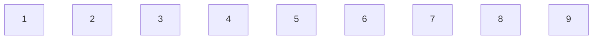
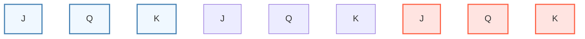
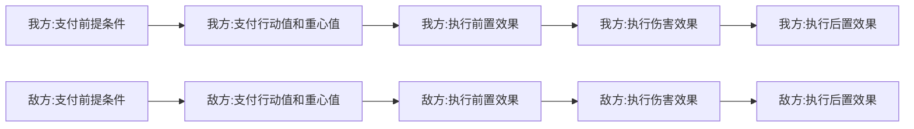
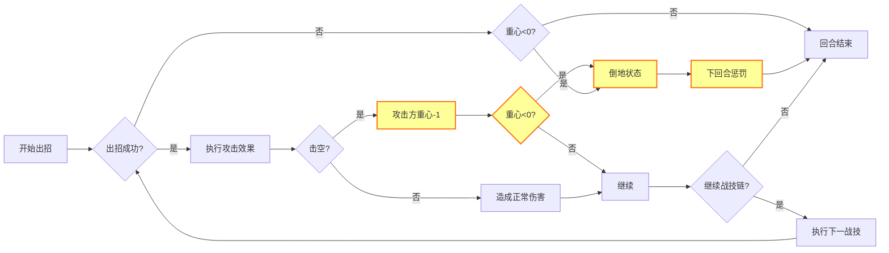
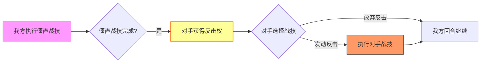
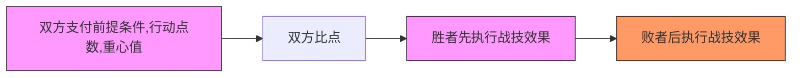
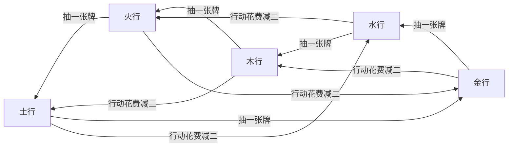

# 法典

### **《法典》—— 一维战线的战术卡牌对决**

*在九格直线战场上运筹帷幄，用卡牌与位移谱写致命连招！*

#### **游戏简介**

《法典》是一款在线性战场上展开的卡牌战术对战游戏。两名玩家在**1×9的直线战场**（位置1至9依次排列）中博弈：通过组合流派战技形成**战技链**，精准控制**行动**🎯与**重心**⚖️，辅以**卡牌系统**调度资源。胜负取决于卡牌组合、位移控制与风险计算的三角平衡！

# 最低游戏组件要求

场地牌：9张

角色指示牌：2张

角色标记牌：5张

游戏牌：36张

总计：52张牌

可选：🎲🎲🎲🎲🎲🎲

# 用扑克牌游戏（可选）

使用鬼牌（$【大王】$、$【小王】$）来标记角色位置（右手侧为正向），使用$【J】$、$【Q】$、$【K】$来指示场地：

将**商标牌**剪开（纵向四分，横向八分）做成计数标记物（$2$个用于标记血量个位，$12×2$个用来标记行动点数，$3×2$个标记重心值），用$【10】$和一个计数标记物标记血量个位，再用$【J】$表示$10$，$【Q】$表示$20$，$【K】$表示$30$（若不足，可用一张剩余牌替换场地牌中的$【J】$、$【Q】$、$【K】$），$【10】$标记血量个位方法如下：

# 简介

------

### 核心机制

#### 🎯 **线性战场，距离即生死**

-   **九格单线战场**：位置1（我方起点）至9（敌方起点）直线排布，**距离=位置差值**（如从位3到位6需3步）
-   **位移连锁效应**：
     ✅ ​**​击退/拉近​**​：强制改变敌我位置差（如枪帖「直贯」击退2步）
     ⚠️ ​**​撞墙惩罚​**​：将对手逼至位置1或9时可能触发追加伤害！
-   **位置战略价值**：
     ▶️ 空间帖依赖​**​数字位置​**​（如「五律」需站位置5）
     ▶️ 刺客帖需绕至​**​对手身后​**​

#### ⚡ **战技链系统——行动的艺术**

-   **12点行动上限**：行动点数≤12，超限溢出无效！
-   **致命取舍**：
     -   ⚠**僵直战技**（==高亮标注==）威力巨大，但发动后**对手获得反击权**！

#### 🃏 **卡牌驱动战术**

| 卡牌类型         | 功能说明                          | 战术意义 |
| ---------------- | --------------------------------- | -------- |
| **小牌**（36张） | 战技燃料（红桃♥=剑术/黑桃♠=位移） | 流派核心 |

>   ✨ **卡牌联动**：弃牌触发被动（如火枪帖「游击」弃黑桃♠可移动），资源管理=胜负关键！

#### 🎭 **角色构筑深度**

角色由三大模块定义：

-   **引帖**：选择战斗流派（拳/剑/法/枪/时空等）
-   **赐福**：主动技能（如法师「火舌」弃牌灼烧，以及角色的技能）
-   **诅咒**：被动代价（如「嗜血」增伤但自损体力）

>   **流派战术范例**：
>
>   -   **火枪帖**：用「装填」叠加伤害，「炮决」在位置1狙杀位置9的敌人
>   -   **空间帖**：通过「素跃」瞬移质数位（2、3、5、7）触发数字律
>   -   **刺客帖**：用「幽步」镜像位移绕后发动「背刺」

------

### **胜负判定**

🏁 **终结对手的两种方式**：

1.  **常规击杀**：将对手体力值削减至0
2.  **战术处决**：满足条件秒杀（如枪帖「炮决」最远距离击杀）

------

**进入《法典》世界，在直线战场上用卡牌编织死亡乐章！**

>   “这不是简单的抽卡游戏——每一次位移都在重塑生死线，每一张牌都在撕裂时空！”

#游戏规则

### 角色牌

#### 引帖-角色的战技表

引帖包含角色的主要战技。**设计案例**：

>   各种“帖”类技能体系

一般来说，一个角色会携带两个以上的“帖”。

#### 技能🌀

角色或【引帖】开头的特殊技能或战技。**设计案例**：

>   「背刺」：需满足背后位，距离1且敌我朝向相反，……
>
>   「飞弹」：距离每增加两步，伤害加一
>
>   「嗜血」：造成伤害加一，然后自身流失一点体力或弃一张牌
>   「笨重」：若上一招行动过，此招行动值加一
>   「失控」：使用法术后，弃一张牌
>
>   ……

一般来说，一个角色会携带一个或更多“技能”，“技能”不一定是好的，可能有负面效果。

#### 体力值、重心值

每个角色都不尽相同，体力值：40左右；**重心**⚖️：3左右；也可能会有其他数值在此处标记。

### 战斗场地

战斗场地有九个空位。双方最开始处于两端。双方对于位置的计算是对称的，我方视角的位置$【a】$是敌方视角的$【9-a】$。

### 回合流程

每个回合开始时，无论是谁的回合，所有人都会将行动点数重置为12。当自己的回合开始时：

####复原重心值

把重心值恢复为原始值。（只有自己回合开始时，才会把重心值恢复为原始值）

#### 组织战技

战技可以无限组织，直到无法继续组织，结束回合，同时，不满足所有战技的触发条件时，回合也结束。

若战技中间的效果失败，后面的效果不执行：

僵直战技执行后，可能会插入对手的反击：

非插入的战技执行时，可能会插入对手的迅捷战技：

==比点==：双方同时弃一张牌：$【点数】$大者为胜者，若平，当前回合者为胜者；然后双方抽一张牌。迅捷战技具有==比点==**加成**。

==倒地状态==：从倒地时，直到下回合结束，不可出招。

⚠️==战技==为**僵直战技**，发动==高亮的战技==结束后，对手可以出招反击一次（只有在自己的回合外，才有反击一说）。

⚡*战技⚡为迅捷战技，可以在对手出招时同时发动。

### 游戏牌-36张

所有角色共有牌池，用于发动战技的消耗，没有特殊的效果：

-   **黑桃♠  1~9        红桃♥  1~9**
-   **梅花♣  1~9        方片♦  1~9**

### 胜负判定

胜利条件：

1.  ==对手体力归零==
2.  ==特殊击杀==（如《火枪帖》·「炮决」最远距离击杀）

# 多人模式

### 战斗场地扩展（$[\frac{【游玩人数】}{2}]\times9$）：

### 牌堆扩容

牌堆牌数：$[\frac{【游玩人数】}{2}]\times36$

### 回合流程更改

每个阵营作为整体，执行一个回合，总行动点数：$6+6\times \frac{【游玩人数】}{【阵营数】}$

重心值依然每个角色单独计算。

每个角色发动战技时，要先声明目标对手。

# 战技帖

### **基础战斗术语**

|   **术语**   |                    **定义**                     |          **应用场景**           |
| :----------: | :---------------------------------------------: | :-----------------------------: |
|   **行动**   | 战技的“部署费用”，行动点数$≤12$（行动点数上限） | 所有战技右上角标注（如行动值3） |
|   **重心**   |               初始约3点，<0时倒地               |  支付战技的消耗，倒地状态惩罚   |
| **僵直战技** |    高亮标注（⚠️==技能名==），发动后让出反击权    |     高伤害技如拳帖「冲拳」      |
| **迅捷战技** |        ⚡️*标记⚡️，可插入对手任何战技中行动        |         刺客帖「背刺」          |

**注：在角色发动战技时，该角色自动改为面朝对手。**

# 〇·毋须注明：必备

### 「专注」🌀

回合开始时，可自减六点行动点数并抽一张牌，则本回合你其他「技能」皆失效，对手⚡️*战技⚡️无法插入。

### 1·洞察♣️

-   **行动**🎯：3
-   **前提条件**：弃一张梅花♣牌
-   **后续效果**：观看对手手牌，行动一步

### 2·抉择🗑️

-   **距离**📏：4、5、6
-   **前提条件**：弃一张牌，不得为本回合弃过的花色
-   **后续效果**：行动点数加二或重心值加一（不得超限）

###3·敏锐♥️

-   **重心**⚖️：1
-   **前提条件**：弃一张红桃♥牌
-   **后续效果**：下一招计算距离可$±1$，抽一张牌

###4·启示♦️

-   **行动**🎯：2
-   **前提条件**：弃一张方片♦牌
-   **后续效果**：随机翻页并停下，发动其中一个战技

### 5·灵感🎴

-   **距离**📏：4、5、6；**行动**🎯：3
-   **前提条件**：手牌数不多于对手
-   **后续效果**：抽一张牌

###6·出拳👊

-   **距离**📏：1；**伤害**💥：1；**行动**🎯：2

### 7·头槌♠️

-   **距离**📏：0；**伤害**💥：3；**行动**🎯：1
-   **前提条件**：弃一张黑桃♠牌
-   **后续效果**：击退两步，抽一张牌

### 8·移动👣

-   **行动**🎯：3
-   **前提条件**：弃一张牌，不得为本回合弃过的花色
-   **后续效果**：行动$【点数】$步，**若撞墙：**减二体力并反弹，抽一张牌

# 一·拳帖

### 「激怒」🌀

自己回合内受到伤害时，回复一点行动点数。

### 「嘲讽」🌀

回合内，僵直时，若对手不反击，对手受到两点伤害。

### 1.1·⚠️==拳术·直冲==🎴

-   **距离**📏：1、2；**伤害**💥：2；**行动**🎯：2
-   **前置效果**：可向前一步
-   **后续效果**：击退一步，抽一张牌

### 1.2·⚡️*拳术·钩拳⚡️👣

-   **距离**📏：1、2；**伤害**💥：2；**行动**🎯：3
-   **前提条件**：弃一张奇数点数牌
-   **后续效果**：击退一步，行动一步

### 1.3·⚡️*拳术·闪步⚡️🛡️

-   **距离**📏：1、2；**重心**⚖️：1；**比点**🔢：+1
-   **前提条件**：弃一张偶数点数牌
-   **后续效果**：后退两步

### 2·下踢♥️👣

-   **距离**📏：1、2、3；**伤害**💥：2；**行动**🎯：2
-   **前提条件**：弃一张红桃♥牌
-   **后续效果**：行动一步，作为反击招式时，对手$【重心值】$减二

### 3·擒拿👣

-   **距离**📏：2、3；**行动**🎯：2
-   **后续效果**：拉近对手一步，行动一步

### 4·⚠️==冲拳==👊🎴

-   **距离**📏：1；**伤害**💥：$【本回合出招数】$；**行动**🎯：3
-   **后续效果**：击退$【本回合出招数】$步，抽一张牌

### 5·无影👊

-   **距离**📏：1、2、3；**伤害**💥：$\ 2×【位置转折次数】$
-   **前提条件**：本回合每招结束后，位置变化呈“进→退→进”

### 6·反扑👤

-   **距离**📏：2、3；**伤害**💥：3；**重心**⚖️：1
-   **前提条件**：上一招结束时，背对对手
-   **后续效果**：抽$【距离】$张牌，行动到对手的位置

### 7·⚠️==铁靠==🧱♦️♦️

-   **距离**📏：1；**伤害**💥：4
-   **前提条件**：弃两张方片♦牌
-   **后续效果**：击退两步，若对手撞墙：追加三点伤害，抽两张牌

### 8·⚡️*截脉⚡️👣

-   **距离**📏：1、2；**行动**🎯：2；**重心**⚖️：1
-   **前提条件**：手牌$【点数和】$整除三（展示手牌）🧮
-   **前置效果**：行动一步
-   **后续效果**：弃对手一张牌，可自减一点体力以获得此牌

# 二·剑帖

### 「猩红」🌀

击退对手时，可自减一点体力，抽一张牌。

### 1.1·⚠️==剑术·直刺==🧱

-   **距离**📏：3、4；**伤害**💥：4；**行动**🎯：3
-   **前置效果**：向前一步
-   **后续效果**：击退三步，若对手撞墙：追加三点伤害，抽一张牌

### 1.2·剑术·横斩🧱

-   **距离**📏：2、3；**伤害**💥：3；**行动**🎯：2
-   **前提条件**：弃一张黑色牌
-   **前置效果**：向前一步
-   **后续效果**：击退一步，若对手撞墙：追加三点伤害，抽一张牌

### 1.3·剑术·上挑👣

-   **距离**📏：1、2；**伤害**💥：1；**重心**⚖️：1
-   **前提条件**：弃一张红色牌
-   **后续效果**：抽一张牌，可后退至多三步或前进一步

### 1.4·⚠️==剑术·下劈==🎴

-   **距离**📏：2、3；**伤害**💥：4；**行动**🎯：2
-   **前提条件**：对手反击过
-   **后续效果**：向前一步，抽一张牌

### 2·⚡️*格挡⚡️🛡️🎴

-   **重心**⚖️：1；**比点**🔢：+2
-   **前提条件**：手牌$【点数和】$整除五（展示手牌）🧮
-   **前置效果**：取消被击退和伤害
-   **后续效果**：抽一张牌，然后可立即反击一次

### 3·穿心🗡️🧱

-   **距离**📏：4；**伤害**💥：12
-   **前提条件**：弃四张牌：完成🧮二十四点🧮
-   **前置效果**：向前两步
-   **后续效果**：击退两步，**若对手撞墙：将其击杀**

### 4·风斩🌸🌸

-   **距离**📏：4；**伤害**💥：3；**重心**⚖️：1
-   **前提条件**：弃两张同花色牌
-   **前置效果**：向前一步
-   **后续效果**：击退一步，本回合所有剑术伤害加三

### 5·⚠️==燕上==🎴👣

-   **距离**📏：3、4；**伤害**💥：2；**重心**⚖️：1
-   **前提条件**：手牌$【点数和】$整除五（展示手牌）🧮
-   **前置效果**：行动一步
-   **后续效果**：击退两步，抽一张牌

### 6·⚡️*居合⚡️🗡️🎴

-   **距离**📏：3；**伤害**💥：5；**比点**🔢：+2
-   **前提条件**：本回合累计击退对手三步，发动后重置
-   **后续效果**：击退一步，向前五步，抽一张牌

### 7·连环🎴

-   **距离**📏：2、3；**伤害**💥：2；**重心**⚖️：1
-   **前提条件**：$【重心值】=【手牌数】$
-   **前置效果**：向前一步
-   **后续效果**：抽一张牌，取消本回合所有僵直

### 8·⚠️==反刺==👤🎴3️⃣

-   **距离**📏：1、2；**伤害**💥：3；**行动**🎯：3；**重心**⚖️：1
-   **前提条件**：上一招结束后，背对对手
-   **后续效果**：抽三张牌

# 三·法帖

###「火舌」🌀

每回合限一次，你可亮出对手一张牌，然后你可弃一张同花色牌，对其造成四点伤害。

###「回溯」🌀

每回合结束时，若对手的位置是回合开始时的位置，你可抽一张牌。

### 1·⚠️==读心==💫

-   **距离**📏：1、2、3；**行动**🎯：3
-   **前提条件**：弃$【点数和】=10$若干张牌
-   **后续效果**：行动一步，观看对手手牌：获得等量牌

### 2.1·火·燃殇♠️

-   **距离**📏：4、5；**伤害**💥：2；**行动**🎯：2
-   **前提条件**：弃一张黑桃♠牌
-   **后续效果**：抽一张牌，之后每招对对手追加一点伤害直到回合结束

### 2.1·火·狱炎♠️♠️

-   **距离** 📏：3；**伤害** 💥：6；**行动** 🎯：3
-   **前提条件** ：弃两张黑桃♠牌
-   **后续效果** ：之后每招对对手追加两点伤害直到回合结束

### 3·⚡️*雷电⚡️♠️

-    **距离**📏：4、5；**伤害**💥：4；**行动**🎯：3
-   **前提条件**：弃一张黑桃♠点数$4、5、6、7$牌
-   **后续效果**：击退一步，抽一张牌

### 4·⚡️*寒霜⚡️♣️

-   **距离**📏：3、4；**伤害**💥：1；**比点**🔢：+1
-   **前提条件**：弃一张梅花♣牌
-   **后续效果**：行动一步，本回合受到伤害减一

### 5.1·灵能·采集

-   **前提条件**：弃一张点数$A、2$牌
-   **后续效果**：行动一步，下一招无视前提条件

### 5.2·灵能·涌动

-   **前提条件**：弃一张点数$8、9$牌
-   **后续效果**：抽一张牌，本回合**比点**🔢+2。

### 6·⚡️*狂风⚡️🎴

-   **距离**📏：6、7；**行动**🎯：3
-   **后续效果**：击退一步，抽一张牌

### 7·⚡️*治愈⚡️❤️‍🩹

-   **距离**📏：5、6、7；**重心**⚖️：1
-   **前提条件**：弃两张同点数牌
-   **后续效果**：行动一步，体力值加八

### 8·牵引♦️

-   **距离**📏：4、5；**行动**🎯：2
-   **前提条件**：弃一张方片♦牌
-   **后续效果**：抽一张牌，移动对手两步，然后行动一步

# 四·枪帖

### 「穿云」🌀

若击退后对手撞墙，可行动一步，抽一张牌且本回合枪术战技伤害加二。

### 1·⚠️==直贯==🎴

-   **距离**📏：4、5、6；**伤害**💥：3；**行动**🎯：2
-   **前置效果**：向前一步
-   **后续效果**：击退两步，抽一张牌

### 2·扫堂♠️

-   **距离**📏：3；**伤害**💥：1；**行动**🎯：1
-   **前提条件**：弃一张黑桃♠牌
-   **后续效果**：抽一张牌，对手$【重心值】$减一

### 3·⚡️*回马⚡️👤🎴

-   **距离**📏：1、2；**伤害**💥：3；**行动**🎯：3；**比点**🔢：+2
-   **前提条件**：上一招结束后，背对对手
-   **后续效果**：行动至多两步，抽一张牌

### 4·⚠️==破甲==🎴

-   **距离**📏：5、6；**伤害**💥：3；**行动**🎯：2
-   **前提条件**：本回合未造成过伤害
-   **后续效果**：取消本回合任何伤害减免效果，抽一张牌

### 5.1·⚡️*防守·卸力⚡️🛡️♥️

-   **距离**📏：2、3；**重心**⚖️：1；**比点**🔢：+1
-   **前提条件**：弃一张红桃♥牌
-   **后续效果**：行动一步，击退一步，对手弃一张牌

### 5.2·⚡️*防守·拒马⚡️

-   **距离**📏：$【手牌数】$；**伤害**💥：4；**行动**🎯：2
-   **前提条件**：上一招对手越过你，弃一张牌
-   **后续效果**：行动一步，对手移回越过前的位置

### 6·⚡️*游龙⚡️🎴

-   **距离**📏：4、5；**伤害**💥：2；**重心**⚖️：1
-   **前提条件**：不含同色手牌（展示手牌）
-   **后续效果**：抽一张牌，行动至多两步

### 7·⚠️==崩山==🎴3️⃣

-   **距离**📏：2、3；**伤害**💥：3
-   **前提条件**：击退对手后，对手：$【位置】=【手牌数】$
-   **后续效果**：击退三步，抽三张牌

### 8·绝杀·破军♠️♣️♦️️

-   **距离**📏：4、5；**伤害**💥：6
-   **前提条件**：弃一张黑桃♠牌、一张梅花♣牌和一张方片♦牌
-   **后续效果**：击退三步，对手倒地，抽两张牌

# 五·火枪帖

### 「鹰隼」🌀

失去梅花♣牌时，立即回复一点行动点数。

### 「游击」🌀

失去黑桃♠牌时，立即行动一步。

### 「走火」🌀

出招失败时，受到该招数伤害值的伤害，抽一张牌。 

### 1·⚡️*装填⚡️💣

-   **行动**🎯：1
-   **前提条件**：弃一张牌
-   **后续效果**：本回合下一个火枪战技伤害加二

### 2·⚡️*瞄准⚡️📍

-   **重心**⚖️：1
-   **后续效果**：放置一枚$【标记】$，对该位置伤害加一，若曾放置过，改为移动这枚$【标记】$（不同帖之间的$【标记】$是互通的）

### 3·⚠️==点射==💣

-   **距离**📏：4；**伤害**💥：4；**行动**🎯：2
-   **前提条件**：弃一张牌
-   **后续效果**：击退一步

### 4·⚠️==连发==💣❓🧱

-   **距离**📏：$2+x$；**伤害**💥：$2x$；**行动**🎯：$2x$
-   **前提条件**：弃$x$张牌
-   **后续效果**：击退$x$步，若对手撞墙：追加三点伤害

### 5·⚠️==轰击==💣💣🧱

-   **距离**📏：3；**伤害**💥：6；**重心**⚖️：1
-   **前提条件**：弃两张牌
-   **后续效果**：击退两步，若对手撞墙：追加四点伤害

### 6·⚠️==铅雨==💣

-   **距离**📏：7、8；**伤害**💥：4；**行动**🎯：2
-   **前提条件**：本回合单个战技造成10点伤害且为发动过本战技，弃一张牌
-   **后续效果**：本回合火枪术战技伤害加二

### 7·⚠️==弹幕==💣♦️

-   **距离**📏：5、6；**伤害**💥：$\ 2×【♦牌数】$
-   **前提条件**：弃所有方片♦牌

### 8·⚠️==炮决==💣♥️

-   **距离**📏：7、8；**伤害**💥：10；**行动**🎯：4；**重心**⚖️：1
-   **前提条件**：弃三张红桃♥牌
-   **后续效果**：抽一张牌，若距离为最远：将对手击杀

#六·空间帖

### 「律动」🌀

若你的$【位置】$为偶数，可弃一张梅花♣牌，移至$\frac{【位置】}{2}$并减一点体力。

### 1.1·⚠️==一律==🎴

-   **距离**📏：$【手牌数】$；**伤害**💥：1；**行动**🎯：2
-   **前提条件**：$【位置】=1$
-   **后续效果**：抽一张牌

### 1.2·二律❤️‍🩹

-   **距离**📏：1；**伤害**💥：1；**重心**⚖️：1
-   **前提条件**：$【位置】=2$
-   **后续效果**：加两点体力，瞬移到任意位置

### 1.3·⚠️==三律==🎴👣

-   **距离**📏：2、3；**伤害**💥：2；**重心**⚖️：1
-   **前提条件**：$【位置】=3$
-   **后续效果**：行动一步，抽一张牌

### 1.4·⚡️*四律⚡️

-   **距离**📏：2；**伤害**💥：1；**行动**🎯：3
-   **前提条件**：$【位置】=4$
-   **后续效果**：瞬移到任意位置

### 1.5·五律

-   **距离**📏：$【重心值】$；**伤害**💥：$【手牌数】$；**行动**🎯：$【体力值】$
-   **前提条件**：$【位置】=5$

### 1.6·⚡️*六律⚡️

-   **距离**📏：2；**伤害**💥：1；**行动**🎯：3
-   **前提条件**：$【位置】=6$
-   **后续效果**：瞬移到任意位置

### 1.7·⚠️==七律==🎴👣

-   **距离**📏：2、3；**伤害**💥：2；**重心**⚖️：1
-   **前提条件**：$【位置】=7$
-   **后续效果**：行动一步，抽一张牌

### 1.8·八律❤️‍🩹

-   **距离**📏：1；**伤害**💥：1；**重心**⚖️：1
-   **前提条件**：$【位置】=8$
-   **后续效果**：加两点体力，瞬移到任意位置

### 1.9·⚠️==九律==🎴

-   **距离**📏：$【手牌数】$；**伤害**💥：1；**行动**🎯：2
-   **前提条件**：$【位置】=9$
-   **后续效果**：抽一张牌

### 2·⚡️*素跃⚡️🌸🌸

-   **重心**⚖️：1；**比点**🔢：+1
-   **前提条件**：弃两张同花色牌
-   **前置效果**：移动至位置：$\{2,3,5,7\}$
-   **后续效果**：根据跳跃距离：
    -   一步：恢复三点体力
    -   两步：抽两张牌
    -   三步：下一个战技伤害加三

### 3·⚠️==置换==🎴

-   **伤害**💥：1；**行动**🎯：3
-   **前置效果**：交换双方位置
-   **后续效果**：抽一张牌

### 4·⚠️==击矢==

-   **伤害**💥：$∣【位置】-3∣$；**行动**🎯：4
-   **后续效果**：若双方$【位置和】$整除四：追加四点伤害，抽一张牌

### 5·⚡️*瞬移⚡️🛡️

-   **行动**🎯：$【位置】$；**比点**🔢：+2
-   **前置效果**：将伤害转化为同数值$【位置】$（至多为九）

### 6·折叠

-   **距离**📏：2、4、6；**伤害**💥：3；**行动**🎯：2
-   **前提条件**：双方$【位置】$都为偶数
-   **后续效果**：将双方$【位置】$移动到$\frac{【位置】}{2}$

### 7·⚠️==切割==

-   **伤害**💥：3；**重心**⚖️：1
-   **前置效果**：将你/对手$【位置】$关于对手/你镜像，抽一张牌

### 8·⚠️==禁锢==🌸🌸🌸

-   **行动**🎯：4
-   **前提条件**：弃三张同花色牌
-   **后续效果**：本回合和下回合对手无法移动，抽一张牌

# 七·时间帖📍

### 「冻结」🌀

回合结束时，若发动过六个及以上战技，可令对手跳过回合，然后你失去「冻结」🌀（也就是说，一局游戏只能用一次）。

### 1·加速🌸🌸

-   **前提条件**：弃两张同花色牌
-   **后续效果**：下一个战技的$【行动值】$不计入“$【行动值】$总和不得超过12”的限制，也不扣减重心值

### 2·⚡️*时滞⚡️

-   **行动**🎯：3；**重心**⚖️：1；**比点**🔢：+1
-   **后续效果**：本回合所有产生位置变化的战技$【行动值】$加二

### 3·⚡️*预判⚡️🎴

-   **行动**🎯：2；**重心**⚖️：1；**比点**🔢：+2
-   **前提条件**：手牌$【点数和】$整除$【手牌数】$（展示手牌）🧮
-   **后续效果**：观看对手手牌，获得其中一张牌

### 4·⚠️==镜像==

-   **行动**🎯：1
-   **后续效果**：发动一个可发动的对手的战技

### 5·⚠️==光刺==

-   **距离**📏：3、4、5；**伤害**💥：1；**行动**🎯：3
-   **后续效果**：若目标位置与**上回合开始时**相同：伤害加四，抽一张牌

### 6·⚡️*残影⚡️📍

-   **行动**🎯：3；**重心**⚖️：1
-   **后续效果**：在当前位置放置一枚$【标记】$（至多一个，不同帖之间的$【标记】$是互通的）

### 7.1·⚡️*回溯·残影⚡️📍

-   **行动**🎯：2；**比点**🔢：+2
-   **前提条件**：失去两点体力
-   **后续效果**：返回$【标记】$的位置并移除$【标记】$

### 7.1·⚡️*回溯·流光⚡️

-   **行动**🎯：3；**比点**🔢：+1
-   **前提条件**：失去两点体力
-   **后续效果**：瞬移至本回合开始时位置

### 8·食时🎴❤️‍🩹

-   **行动**🎯：$【出招数】$
-   **后续效果**：抽一张牌，回复一点体力，结束回合

#八·刺客帖📍

###「无光」🌀

每次对背对你的对手造成伤害后，本回合所有战技造成的伤害加二。

### 1·⚡️*背刺⚡️👤♥️

-   **距离**📏：1；**伤害**💥：3；**比点**🔢：+2
-   **前提条件**：对手背对你，弃一张红桃♥牌
-   **后续效果**：若为对手回合，追加五点伤害

### 2.1·⚡️*幽步·一⚡️👣♦️

-   **行动**🎯：3；**重心**⚖️：1
-   **前提条件**：弃一张方片♦牌
-   **前置效果**：行动一步

### 2.2·⚡️*幽步·二⚡️♠️

-   **行动**🎯：3；**重心**⚖️：1
-   **前提条件**：弃一张黑桃♠牌
-   **前置效果**：将位置镜像

### 2.3·⚡️*幽步·三⚡️♣️

-   **伤害**💥：2；**行动**🎯：3；**重心**⚖️：1
-   **前提条件**：弃一张梅花♣牌
-   **前置效果**：弃对手一张牌

### 3·残影📍♦️

-   **行动**🎯：3
-   **前提条件**：弃一张方片♦牌
-   **后续效果**：在一个空位放置$【标记】$（至多一个，不同帖之间的$【标记】$是互通的）

### 4·⚠️==跃绞==🎴👤📍

-   **距离**📏：$x$；**伤害**💥：$4-2x$；**行动**🎯：3
-   **前置效果**：与$【标记】$交换位置
-   **后续效果**：若对手背对你：追加两点伤害，抽一张牌

### 5·木兵📍👣

-   **行动**🎯：2
-   **前提条件**：$【标记】$与你处于对手两侧
-   **后续效果**：行动一步，$【标记】$以对手为对称轴行动一步

### 6·⚠️==绝寂==👁️‍🗨️📍♦️

-   **距离**📏：0；**伤害**💥：4；**行动**🎯：3
-   **前提条件**：$【标记】$、你、对手在同一位置，弃一张方片♦牌
-   **后续效果**：若你的体力小于对手，**交换双方的体力值**

### 7·钉杀👤📍

-   **距离**📏：1；**伤害**💥：3；**行动**🎯：3
-   **前提条件**：$【标记】$在对手邻接位
-   **前置效果**：将对手与$【标记】$位置互换
-   **后续效果**：若互换后相互背对，立即发动一次⚡️*背刺⚡️不计行动值

### 8·⚡️*鬼返⚡️🎴👣👤

-   **距离**📏：1、2；**伤害**💥：2；**行动**🎯：3
-   **前提条件**：背对对手
-   **后续效果**：抽一张牌，行动一步

# 九·玩偶帖📍⚠️

### 「宿命」🌀

可代替“玩偶”承担伤害，“玩偶”被摧毁时，流失十点体力。

### 「提线」🌀

失去黑桃♠牌时，移动$【标记】$一步，失去梅花♣牌时，行动一步。

### 1·⚠️==召唤==📍♣️♣️

-   **前提条件**：弃两张梅花♣牌
-   **后续效果**：在空位放置一枚$【标记】$，让$【标记】$视为“玩偶”（至多一个，不同帖之间的$【标记】$是互通的）：
    -   体力值：15；**重心**⚖️：与宿主共用
    -   引帖：〇+随机“帖”

### 2·牵引

-   **前置效果**：操纵“玩偶”使用战技，行动值消耗等量

### 3·替身📍

-   **行动**🎯：3
-   **前置效果**：以$【标记】$位置发动攻击，本体仍保留原位
-   **后续效果**：发动本体的一个战技

### 4·⚠️==牵丝==🎴📍

-   **伤害**💥：1；**行动**🎯：2
-   **后续效果**：对与$【标记】$之间的所有位置的所有对手造成伤害，抽一张牌

### 5·⚠️==爆体==🎴📍♥️♠️

-   **伤害**💥：$【玩偶剩余体力】$
-   **前提条件**：弃一张红桃♥牌和一张黑桃♠牌
-   **后续效果**：摧毁“玩偶”，对$【标记】$邻接位置所有对手造成伤害，抽一张牌

### 6·⚠️==颂词==❤️‍🩹📍♦️

-   **行动**🎯：3
-   **前提条件**：弃一张方片♦牌
-   **后续效果**：对与$【标记】$之间的位置的所有角色回复两点体力，抽一张牌

### 7·⚡️*牢笼⚡️

-   **伤害**💥：2；**行动**🎯：2；**比点**🔢：+2
-   **前提条件**：对手在一次行动内穿越你与“玩偶”
-   **后续效果**：结束当前回合，抽一张牌

### 8·⚠️==终幕==

- **前提条件**：你死亡而“玩偶”未死亡
- **后续效果**：“玩偶”立即执行其行动值之和为其体力值数的连招并死亡

# 十·游侠帖

### 「直觉」🌀

当与对手距离为$【手牌数】$时，战技伤害加一。

### 1·⚠️==长弓==🎴

-   **距离**📏：$4$ ~ $\infin$；**伤害**💥：3；**重心**⚖️：1
-   **后续效果**：抽一张牌

### 2·⚠️==连珠==🎴👣

-   视为三次连续的僵直战技
-   **距离**📏：3、4、5；**伤害**💥：$2×3$；**行动**🎯：3
-   **后续效果**：每击中一次 ，行动一步，抽一张牌；三次都击中，弃对手一张牌

### 3·⚡️*蹬墙⚡️👣♥️

-   **重心**⚖️：1；**比点**🔢：+2
-   **前提条件**：撞墙，弃一张红桃♥牌
-   **后续效果**：行动三步，若绕后对手背后，可立即==【连珠】==

### 4·⚠️==穿林==🎴

-   **伤害**💥：3；**行动**🎯：3
-   **后续效果**：对面朝的方向上所有单位造成伤害，抽一张牌

### 5·⚡️*引弓⚡️♠️

-   **距离**📏：4 ~ $\infin$；**伤害**💥：2
-   **前提条件**：弃一张黑桃♠牌
-   **前置效果**：后退一步

### 6·⚠️==曲射==

-   **距离**📏：4 ~ $\infin$；**伤害**💥：2；**行动**🎯：3
-   **前提条件**：弃一张黑色牌
-   **后续效果**：弃$x$张牌，抽$x$张牌

### 7·⚠️==游猎==🎴♥️

-   **行动**🎯：4
-   **前提条件**：弃一张红桃♥牌
-   **后续效果**：获得对手一张牌，抽一张牌

### 8·飞踢🧱

-   **距离**📏：2、3；**伤害**💥：2；**重心**⚖️：1
-   **前提条件**：弃$x$张牌
-   **后续效果**：击退$x$步，若对手撞墙：追加三点伤害

# 十一·黑暗帖

### 「赤潮」🌀

若你体力值低于对手，你**所有**战技伤害加二

### 1·⚠️==血爆==💥🎴🧱

-   **距离**📏：1、2、3；**伤害**💥：$\frac{6}{【距离】}$；**行动**🎯：2
-   **前提条件**：自减两点体力
-   **后续效果**：击退两步，若对手撞墙：追加两点伤害，抽一张牌

### 2·⚡️*凝爪⚡️❤️‍🩹

-   **距离**📏：1、2；**伤害**💥：$\frac{2}{【距离】}$；**重心**⚖️：1
-   **后续效果**：恢复等同于伤害值的体力

### 3·雾化👣👣

-   **重心**⚖️：1
-   **前置效果**：行动至多两步
-   **后续效果**：若移动后与对手距离小于三，自减$【距离】$点体力

### 4·⚠️==血缚==🎴

-   **距离**📏：4、5；**行动**🎯：2
-   **前提条件**：自减三点体力
-   **后续效果**：拉近对手两步，使其下回合行动值上限减二，抽一张牌

### 5·血契🎴3️⃣

-   **距离**📏：5、6；**行动**🎯：3
-   **前提条件**：自减五点体力
-   **后续效果**：抽三张牌，你下两招战技伤害加三

### 6·⚡️*红障⚡️

-   **距离**📏：4、5；**行动**🎯：3；**重心**⚖️：1
-   **前置效果**：本回合受到伤害减二

### 7·⚠️==狱漩==

-   **伤害**💥：$[\frac{12}{【距离】}]$
-   **前提条件**：弃三张点数连续的牌
-   **后续效果**：对所有人造成伤害，抽一张牌

### 8.1·⚡️*血鬼·虹吸⚡️❤️‍🩹♥️

-   **行动**🎯：3；**重心**⚖️：1；**比点**🔢：+2
-   **前提条件**：上一招造成伤害，弃一张红桃♥牌
-   **后续效果**：恢复等同于对手受到伤害的体力值

### 8.1·血鬼·自噬❤️‍🩹♥️

-   **行动**🎯：3；**重心**⚖️：1
-   **前提条件**：弃一张红桃♥牌
-   **后续效果**：将三点体力值上限转化为体力值

# 十二·魁拔帖

### 「脉鸣」🌀

每回合首次击退效果生效时，可自减1点体力使击退距离+1

### 「蛮血」🌀

当体力≤15时，魁拔战技伤害加二

### 1·⚠️==打击==🎴🧱

-   **距离**📏：1、2；**伤害**💥：1；**行动**🎯：2
-   **后续效果**：击退一步，若对手撞墙：追加一点伤害，抽一张牌

### 2·连击👣

-   **距离**📏：1、2；**伤害**💥：2；**行动**🎯：3
-   **前提条件**：本回合已造成击退
-   **后续效果**：行动一步

### 3·⚡️*屏障⚡️🎴

-   **行动**🎯：6；**重心**⚖️：1
-   **前置效果**：本回合受伤害减二
-   **后续效果**：抽一张牌

### 4·⚠️==冲撞==🎴🧱

-   **距离**📏：2、3；**行动**🎯：3；**重心**⚖️：1
-   **前置效果**：向前两步
-   **后续效果**：击退两步，抽一张牌，若对手撞墙：抽一张牌

### 5·战吼♣️

-   **行动**🎯：2；**重心**⚖️：1
-   **前提条件**：弃一张梅花♣牌
-   **后续效果**：本回合后续魁拔战技伤害加二

### 6·⚡️*破阵⚡️👣♥️

-   **距离**📏：1、2、3；**伤害**💥：3；**重心**⚖️：1
-   **前提条件**：自减三点体力，弃一张红桃♥牌
-   **前置效果**：行动一步
-   **后续效果**：下一招无视距离限制，都将命中

### 7·不屈🎴3️⃣❤️‍🩹

-   **行动**🎯：2
-   **前提条件**：本回合未发动此战技，$【体力值】≤5$
-   **后续效果**：回复五点体力，抽三张牌

### 8·⚠️==封印==🧱♠️3️⃣

-   **距离**📏：4、5、6；**伤害**💥：5；**行动**🎯：3；**重心**⚖️：1
-   **前提条件**：弃三张黑桃♠牌
-   **后续效果**：击退两步，若对手撞墙：对手行动上限**永久减二**，抽一张牌

# 十三·道法帖

### 「轮转」🌀

### 金行·⚠️==锐金==👣♥️

-   **距离**📏：3、4；**伤害**💥：2；**行动**🎯：2
-   **前提条件**：弃一张红桃♥牌
-   **前置效果**：无视伤害减免和取消
-   **后续效果**：行动一步

### 木行·⚠️==生息==🎴❤️‍🩹

-   **距离**📏：$【手牌数】$；**行动**🎯：4；**重心**⚖️：1
-   **后续效果**：回复二点体力，抽一张牌

### 水行·⚡️*玄咒⚡️👣

-   **距离**📏：2、3；**伤害**💥：2；**重心**⚖️：1
-   **后续效果**：拉近对手一步，使其下招行动值加二，然后行动一步

### 火行·⚠️==离诀==♠️

-   **伤害**💥：2；**行动**🎯：3
-   **前提条件**：弃一张黑桃♠牌
-   **后续效果**：若$【距离】≤2$，追加两点伤害

### 土行·不动🎴

-   **距离**📏：$【本回合出招数】$；**行动**🎯：3
-   **后续效果**：重心值加一，抽一张牌

### 阴阳·两仪👣👣♣️♣️

-   **行动**🎯：3
-   **前提条件**：弃两张梅花♣牌
-   **后续效果**：行动两步，此招视为任意属性

### 风雷·⚠️==惊引==🧱

-   **距离**📏：4、5；**伤害**💥：2；**行动**🎯：3
-   **后续效果**：此招视为任意属性，击退两步，若对手撞墙：追加两点伤害

### 乾坤·太极♦️

-   **距离**📏：1、2、3；**伤害**💥：3；**重心**⚖️：1
-   **前提条件**：弃一张方片♦牌
-   **后续效果**：对所有攻击范围内敌人造成伤害

# 十四·觅龙帖📍⚠️

### 「深瞳」🌀

回合开始时，可展示对手一张牌，若为红色：观看并调整牌池顶三张牌的顺序。

### 1·⚡️*寻迹⚡

-   **行动**🎯：2
-   **前提条件**：弃一张牌
-   **后续效果**：观看牌池顶三张牌，并可弃其中一张牌

### 2·⚡️*驯令⚡👣

-   **重心**⚖️：1
-   **后续效果**：弃置牌池顶一张牌，若为红色：行动三步，抽一张牌

### 3·掠翼👣

-   **行动**🎯：3
-   **前置效果**：弃置牌池顶两张牌，若非同花色：倒地
-   **后续效果**：行动$【点数和】$步，每经过对手，造成三点伤害，击退一步

### 4·⚠️==龙坠==

-   **行动**🎯：3
-   **前置效果**：弃置牌池顶一张牌
-   **后续效果**：须弃一张同花色牌：对对手造成三点伤害且弃对手一张牌；否则倒地

### 5·⚠️==屠斩==🧱

-   **距离**📏：1、2；**伤害**💥：5；**行动**🎯：3
-   **前置效果**：弃置牌池顶三张牌，若非同花色：倒地
-   **后续效果**：击退对手$【点数和】$步，每次撞墙：追加两点伤害

### 6·龙息🧱

-   **距离**📏：2、3；**伤害**💥：1；**行动**🎯：2
-   **后续效果**：击退一步，**若对手撞墙：**抽一张牌。

### 7.1·⚠️==逆鳞·仪式==🎴🧱

-   **距离**📏：1；**伤害**💥：2；**行动**🎯：3
-   **前提条件**：扣置一张牌，不得为本回合弃过的花色
-   **后续效果**：抽两张牌，击退三步，若对手撞墙：追加三点伤害。

### 7.1·逆鳞·召唤🧱

-   **距离**📏：7；**伤害**💥：$【扣牌数】$；**行动**🎯：3
-   **前提条件**：将一张扣置牌放于牌池顶
-   **后续效果**：击退三步，若对手撞墙：追加三点伤害。

### 8·唤龙🐲📍

-   **行动**🎯：4；**重心**⚖️：1
-   **前提条件**：扣置的牌$【点数和】$为$24$
-   **后续效果**：在空位放一枚$【标记】$，声明一个$【帖】$：你的回合内，$【标记】$有独立于你的六点行动点数和三点重心值可发动〇帖+$【声明帖】$+龙息🧱
